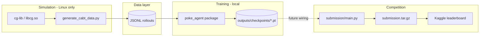
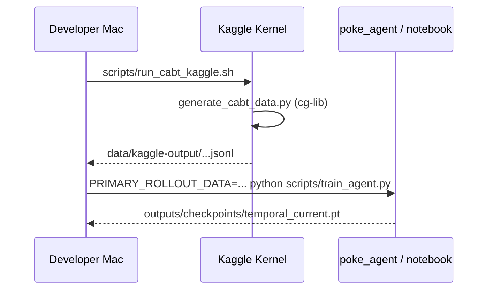
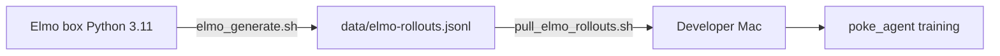
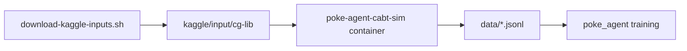
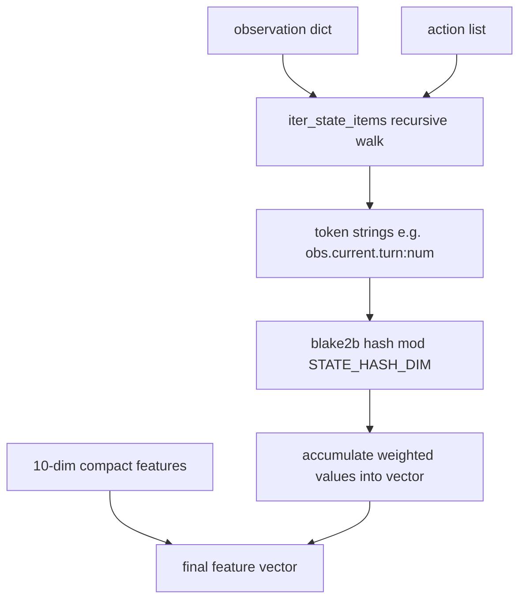
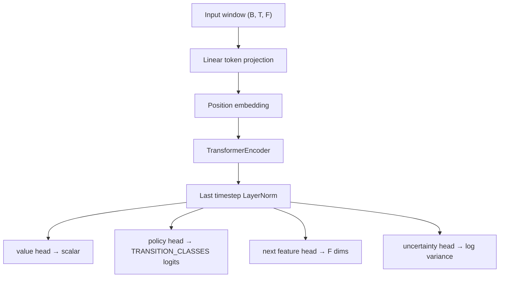
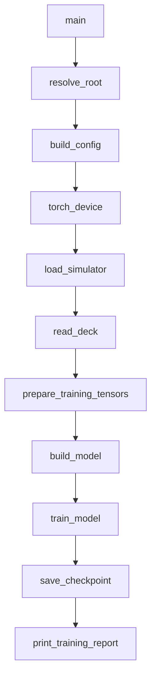
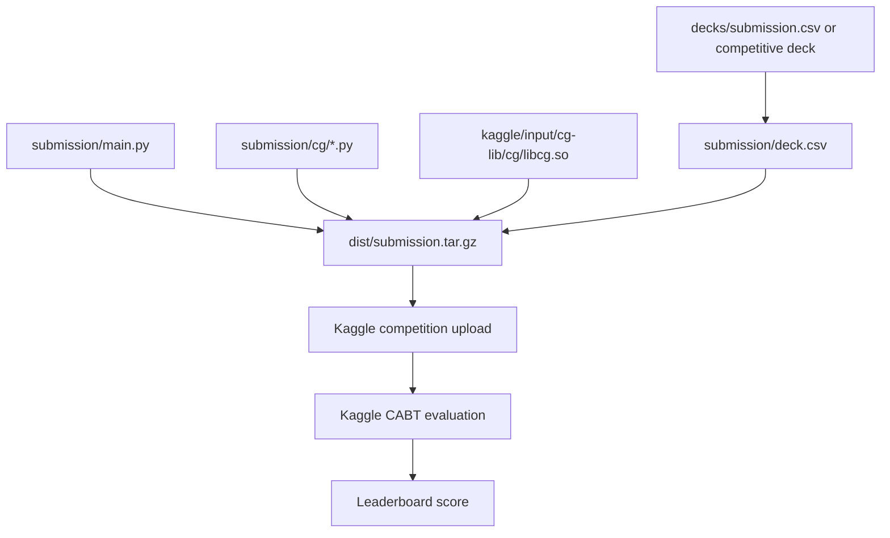

# Architecture

This document describes the end-to-end architecture of **poke-bot-agent**: how CABT
(Card Battle) simulation, rollout generation, model training, and Kaggle submission
fit together, and how the refactored `poke_agent/` Python package implements the
training pipeline previously embedded in `notebooks/poke_agent_unified.ipynb`.

## Table of contents

1. [System overview](#system-overview)
2. [Design goals and constraints](#design-goals-and-constraints)
3. [Deployment topologies](#deployment-topologies)
4. [Repository layout](#repository-layout)
5. [End-to-end data flow](#end-to-end-data-flow)
6. [External dependencies](#external-dependencies)
7. [Rollout data format](#rollout-data-format)
8. [Feature engineering](#feature-engineering)
9. [Model architecture](#model-architecture)
10. [Training objective](#training-objective)
11. [The `poke_agent` package](#the-poke_agent-package)
12. [Scripts and operational tooling](#scripts-and-operational-tooling)
13. [Competition submission path](#competition-submission-path)
14. [Notebook vs package](#notebook-vs-package)
15. [Configuration reference](#configuration-reference)
16. [Extension points](#extension-points)
17. [Known limitations](#known-limitations)

---

## System overview

The project solves a two-environment problem:

| Environment | Role | Key runtime |
|---|---|---|
| **Linux / Kaggle / Docker** | Run the official CABT simulator (`cg-lib`) and generate rollout JSONL | `libcg.so`, Python 3.11+ |
| **Local dev (Mac/Linux)** | Train a PyTorch value/policy model on rollout data | Torch with CUDA, MPS, or CPU |

At a high level, the system has four major stages:



**Current state:** training writes checkpoints under `outputs/checkpoints/` (and
JSON reports under `outputs/reports/`). Legacy `out/value_model.pt` is still read
as a fallback. `scripts/build_submission.sh` bundles the checkpoint into the
submission tarball as `value_model.pt`.

---

## Design goals and constraints

### Goals

- **Separate simulation from training.** CABT requires a Linux native library; Torch
  training should run natively on Apple Silicon (MPS) without Docker overhead.
- **Reproducible rollouts.** JSONL files are the contract between simulation workers
  (Kaggle kernel, Elmo box, local container) and the training runtime.
- **Inspectable pipeline.** The refactored `poke_agent/` package mirrors the notebook
  cell-by-cell so experiments can move out of Jupyter without changing behavior.
- **Competition-safe submission packaging.** Submissions are `.tar.gz` archives with
  `main.py`, `deck.csv`, and `cg/` including `libcg.so`.

### Constraints

- **Kaggle submission limit:** 5 submissions per team per day.
- **cg-lib requires Python 3.10+** (PEP 604 union syntax in `cg/api.py`).
- **`libcg.so` is platform-specific.** It only runs on Linux amd64; Mac hosts cannot
  load the simulator directly.
- **Training loss ≠ competition score.** The model optimizes value/policy/dynamics
  losses on rollout states; official win rate only comes from Kaggle evaluation.

---

## Deployment topologies

### Topology A — Default (Kaggle sim → Mac train)



Best when Docker is unavailable on the training machine and large rollout batches
are needed without tying up local CPU.

### Topology B — Elmo worker (TrueNAS / Ryzen)



Elmo is the preferred high-throughput rollout worker when a dedicated Linux box
with many cores is available. Training still happens on the Mac with MPS.

### Topology C — Local container smoke test



Used for quick validation. Not the default path for large-scale generation.

### Topology D — In-notebook / in-package inline generation

When `cg-lib` is available in the current process (Kaggle notebook, Linux venv),
`poke_agent` can generate a small number of episodes inline via `CABT_EPISODES`
before training. On Mac without cg-lib, this step is skipped automatically.

---

## Repository layout

```
poke-bot-agent/
├── poke_agent/              # Refactored training pipeline (Python package)
│   ├── main.py              # Orchestrates full train pipeline
│   ├── config.py            # Env-based configuration
│   ├── simulator.py         # cg-lib discovery and loading
│   ├── rollout.py           # Episode generation (Linux only)
│   ├── features.py          # Hash features + training array builder
│   ├── dataset.py           # JSONL load + tensor preparation
│   ├── models/              # Agent implementations (temporal transformer, heuristics, hybrid)
│   │   └── temporal_transformer.py  # TemporalTransformer
│   ├── training.py          # Training loop + early stopping
│   ├── checkpoint.py        # Checkpoint save + report printing
│   ├── outputs.py           # Output directory layout helpers
├── notebooks/
│   └── poke_agent_unified.ipynb   # Original monolithic notebook (still supported)
├── scripts/
│   ├── train_agent.py       # CLI entry: python scripts/train_agent.py
│   ├── generate_cabt_data.py    # Production rollout generator (multiprocess)
│   ├── build_submission.sh      # Package submission.tar.gz
│   ├── run_cabt_kaggle.sh       # Push Kaggle simulation kernel
│   ├── run_cabt_container.sh    # Docker smoke / local generation
│   └── elmo_*.sh / pull_*.sh    # Remote worker helpers
├── submission/              # Kaggle agent (competition entry point)
│   ├── main.py                # agent(obs_dict) API
│   ├── deck.csv               # 60-card deck list
│   └── cg/                    # Vendored cg Python + libcg.so at build time
├── decks/                     # Deck pools for simulation matchups
├── data/                      # Generated JSONL rollouts (gitignored)
├── outputs/                   # Training artifacts (gitignored)
│   ├── checkpoints/           # Model checkpoints (.pt)
│   ├── reports/               # Training report JSON per model
│   ├── logs/                  # Training/runtime logs
│   ├── rollouts/              # Inline/generated rollout JSONL
│   └── submissions/           # Optional local submission staging
├── out/                       # Legacy checkpoints (gitignored, fallback)
├── kaggle/                    # Kernel metadata + downloaded inputs
├── containers/cabt/           # Dockerfile for Linux sim container
└── docs/
    └── ARCHITECTURE.md        # This file
```

---

## End-to-end data flow

### Stage 1 — Deck selection

A deck is a list of exactly **60 integer card IDs**. Sources are tried in order:

1. `AGENT_DECK_PATH` env / config default under `decks/competitive/...`
2. `decks/submission.csv`
3. `submission/deck.csv`
4. `deck.csv`
5. Kaggle agent path `/kaggle_simulations/agent/deck.csv`
6. Built-in `SAMPLE_DECK` fallback

Implemented in `poke_agent/deck.py` and mirrored in `scripts/generate_cabt_data.py`.

### Stage 2 — Rollout generation (optional, Linux)

The CABT simulator (`cg.game.battle_start`, `battle_select`, `battle_finish`) plays
games between agents. Each step records a transition row.

**Production path:** `scripts/generate_cabt_data.py` with multiprocessing, deck pools,
and matchup strategies (`sample`, `round-robin`).

**Inline path:** `poke_agent/rollout.py` generates a small episode count when
`CABT_EPISODES > 0` and `cg-lib` is importable.

### Stage 3 — Dataset loading

`poke_agent/dataset.py` picks the first CABT evaluation JSONL from `data_candidates`
in config order. Rows must include full `observation`, `action`, and
`next_observation` fields produced by `scripts/generate_cabt_data.py` (the `cg.game`
engine Kaggle uses). Validation lives in `poke_agent/cabt_validation.py`.

If `REQUIRE_CABT_EVAL_DATA=1` (default) and no valid file exists, training fails
instead of falling back to synthetic smoke data. Set `REQUIRE_CABT_EVAL_DATA=0`
only for offline smoke tests.

### Stage 4 — Feature tensor construction

`poke_agent/features.py` converts each JSONL row into:

- A **feature vector** (compact + hashed full observation)
- A **value target** (win/loss signal from rollout)
- A **transition class** (action hash or feature-delta proxy)
- A **next-state feature vector** for dynamics loss
- A **temporal history window** of up to `WINDOW_SIZE` prior states

### Stage 5 — Model training

`poke_agent/training.py` trains `TransformerRLModel` with a multi-head loss, early
stopping, and AdamW. Best weights are restored before checkpoint export.

### Stage 6 — Checkpoint export

`poke_agent/checkpoint.py` writes `outputs/checkpoints/{model_id}.pt` and a JSON
report to `outputs/reports/{model_id}.json` containing:

- Model weights and architecture metadata
- Feature normalization stats (`feature_mean`, `feature_std`)
- Loss weight configuration
- `training_report` dict with metrics and optional latest Kaggle result

---

## External dependencies

### cg-lib (CABT simulator)

| Artifact | Location | Purpose |
|---|---|---|
| Python API | `cg/api.py`, `cg/game.py`, `cg/sim.py` | Observation parsing, battle loop |
| Native lib | `cg/libcg.so` | Core game engine (ctypes) |

Downloaded via `scripts/download-kaggle-inputs.sh` into `kaggle/input/cg-lib/`.

**Critical:** competition submissions must bundle `libcg.so` inside `cg/`. The build
script copies it at package time:

```bash
scripts/download-kaggle-inputs.sh
scripts/build_submission.sh   # produces dist/submission.tar.gz
```

### PyTorch device backends

`poke_agent/device.py` selects in order: CUDA → MPS → CPU.

Training on Mac should stay **native** (not in Docker) so MPS is available.

### Kaggle environments

- Simulation kernels use `kaggle-environments` with the `cabt` environment.
- Competition submissions are evaluated in isolated agent containers at
  `/kaggle_simulations/agent/`.

---

## Rollout data format

Each JSONL line is one transition (one decision point in one episode).

### Full-state row (from `generate_cabt_data.py`)

| Field | Type | Description |
|---|---|---|
| `episode` | int | Episode index within generation batch |
| `step` | int | Step within episode (0-based) |
| `player` | int | Active player index (0 or 1) |
| `features` | list[float] | Compact 10-dim summary (see below) |
| `observation` | dict | Full CABT observation at this step |
| `action` | list[int] | Chosen action (option indices) |
| `next_observation` | dict | Observation after action |
| `next_features` | list[float] | Compact features of next state |
| `terminal` | bool | Whether this transition ends the episode |
| `value` | float | Outcome value for this player: +1 win, -1 loss, 0 draw |
| `result` | int | Final game result when terminal |
| `reward` | float | Step reward if present |
| `deck0`, `deck1` | str | Deck identifiers used in matchup |
| `legal_action_count` | int | Number of legal options |
| `select_min_count`, `select_max_count` | int | Selection constraints |

### Minimal row (from inline `poke_agent/rollout.py`)

| Field | Type | Description |
|---|---|---|
| `episode` | int | Episode index |
| `step` | int | Step index |
| `features` | list[float] | Compact features only |
| `player` | int | Active player |
| `value` | float | Assigned after episode ends |

The feature pipeline handles both formats. Full-state rows produce richer hashed
features because `observation` and `action` are present.

### Compact feature vector (10 dimensions)

Extracted by `features_from_observation()`:

1. `turn`
2. `yourIndex`
3. Player 0 `deckCount`
4. Player 0 `handCount`
5. Player 0 bench size
6. Player 1 `deckCount`
7. Player 1 `handCount`
8. Player 1 bench size
9. Legal option count
10. `select.maxCount`

---

## Feature engineering

### Hash-based full-state encoding

Because CABT observations are deeply nested JSON, the pipeline uses a fixed-size
**hash trick** instead of hand-crafted parsing for every card field:



Token weighting:
- Observation tokens: weight **1.0**
- Action tokens: weight **0.5**
- Numeric values: scaled with `tanh(value / 100)`
- Booleans: `+1` / `-1`
- Strings: `label.key=value` with amount `1.0`

Default `STATE_HASH_DIM = 256`, so full feature dimension = **10 + 256 = 266**
when observations are present.

### Temporal history windows

For each row at step `t` within an episode, the model receives the last
`WINDOW_SIZE` (default 128) feature vectors as a sequence. Shorter prefixes are
left-padded with a sentinel index and zero mask.

This gives the transformer access to recent game context without recurrent state.

### Transition class labeling

Priority order for policy targets:

1. If `action` present → `stable_hash_index(json(action)) % TRANSITION_CLASSES`
2. Else if terminal → class `TRANSITION_CLASSES - 1`
3. Else → `argmax(|next_compact - compact|) % TRANSITION_CLASSES`

Default `TRANSITION_CLASSES = 8`.

---

## Model architecture

`TemporalTransformer` (`poke_agent/models/temporal_transformer.py`) is a temporal value/policy model:



### Default hyperparameters

| Parameter | Env var | Default |
|---|---|---|
| `d_model` | `MODEL_D_MODEL` | 512 |
| Attention heads | `MODEL_HEADS` | 8 |
| Encoder layers | `MODEL_LAYERS` | 8 |
| FFN dimension | `MODEL_FF` | `d_model * 4` |
| Dropout | `MODEL_DROPOUT` | 0.1 |
| History window | `WINDOW_SIZE` | 128 |

**Constraint:** `MODEL_D_MODEL` must be divisible by `MODEL_HEADS`.

### Output heads

| Head | Shape | Purpose |
|---|---|---|
| `value` | `(B,)` | Predict win/loss value in `[-1, 1]` |
| `policy_logits` | `(B, C)` | Action class distribution |
| `next_features` | `(B, F)` | One-step dynamics prediction |
| `log_variance` | `(B,)` | Heteroscedastic uncertainty for value |

---

## Training objective

Total loss per batch:

```
L = w_v * MSE(value, y)
  + w_p * CrossEntropy(policy, transition_class)
  + w_d * SmoothL1(next_features, next_x)   [non-terminal rows only]
  - w_e * entropy(policy)
  + w_u * heteroscedastic_value_regularizer
```

Default weights (`poke_agent/config.py`):

| Component | Env var | Default |
|---|---|---|
| Value | `LOSS_VALUE_WEIGHT` | 1.0 |
| Policy | `LOSS_POLICY_WEIGHT` | 0.35 |
| Dynamics | `LOSS_DYNAMICS_WEIGHT` | 0.15 |
| Entropy bonus | `LOSS_ENTROPY_WEIGHT` | 0.01 |
| Uncertainty | `LOSS_UNCERTAINTY_WEIGHT` | 0.02 |

### Optimization

- Optimizer: **AdamW** (`LEARNING_RATE=3e-4`, `WEIGHT_DECAY=1e-2`)
- Gradient clipping: max norm **1.0**
- Early stopping: `EARLY_STOP_PATIENCE=10` epochs without `EARLY_STOP_MIN_DELTA` improvement
- Feature normalization: per-dimension mean/std computed on training set

### Interpreting metrics

| Metric | Meaning |
|---|---|
| `value_loss` ↓ | Better win/loss prediction on rollout states |
| `policy_loss` ↓ | Better action-class prediction |
| `dynamics_loss` ↓ | Better one-step feature prediction |
| `total_loss` ↓ | Combined training objective |

**None of these are Kaggle win rate.** Official scores come only from competition
evaluation after submitting `dist/submission.tar.gz`.

---

## The `poke_agent` package

### Pipeline orchestration (`main.py`)



### Module reference

| Module | Responsibility | Key exports |
|---|---|---|
| `paths.py` | Detect repo root from CWD or parent | `resolve_root`, `print_runtime_info` |
| `config.py` | Build config dict from env vars | `build_config`, `env_int`, `env_float` |
| `device.py` | Select Torch device | `torch_device` |
| `simulator.py` | Locate and import cg-lib | `load_simulator`, `SimulatorState` |
| `deck.py` | Load 60-card deck | `read_deck`, `SAMPLE_DECK` |
| `rollout.py` | Play CABT matches, write JSONL rows | `play_match`, `make_random_agent` |
| `features.py` | Hash encoding + array builder | `build_training_arrays`, `combine_features` |
| `dataset.py` | Load JSONL, create tensors | `prepare_training_tensors`, `TrainingTensors` |
| `models/temporal_transformer.py` | Neural network | `TemporalTransformer` |
| `training.py` | Train loop | `build_model`, `train_model` |
| `checkpoint.py` | Save + report | `save_checkpoint`, `print_training_report` |
| `outputs.py` | Artifact paths | `ensure_output_layout`, `resolve_checkpoint_path` |
| `main.py` | Top-level pipeline | `main` |

### `SimulatorState` dataclass

```python
@dataclass
class SimulatorState:
    lib_path: str | None
    available: bool
    error: str | None
    battle_start: Callable | None
    battle_select: Callable | None
    battle_finish: Callable | None
    to_observation_class: Callable | None
```

When `available=False`, rollout generation is skipped without failing training.

### `TrainingTensors` dataclass

Holds all GPU/CPU tensors needed for training:

- `x`, `x_padded` — normalized features + padding row
- `y` — value targets
- `transition_target` — policy class indices
- `next_x` — normalized next-state features
- `terminal` — episode-end mask
- `history_index`, `history_mask` — temporal window indices
- `feature_mean`, `feature_std` — normalization stats for checkpoint export

### Running the package

```bash
# Default pipeline
python scripts/train_agent.py

# Equivalent
python -m poke_agent.main

# Common overrides
PRIMARY_ROLLOUT_DATA=data/mac-rollouts-100k-fullstate.jsonl \
TRAIN_EPOCHS=50 \
BATCH_SIZE=128 \
python scripts/train_agent.py
```

---

## Scripts and operational tooling

| Script | When to use |
|---|---|
| `scripts/train_agent.py` | Run full training pipeline outside Jupyter |
| `scripts/generate_cabt_data.py` | Large-scale multiprocess rollout generation |
| `scripts/run_cabt_kaggle.sh` | Push simulation to Kaggle kernel |
| `scripts/run_cabt_container.sh` | Local Docker smoke test / generation |
| `scripts/download-kaggle-inputs.sh` | Fetch `cg-lib` for local/container builds |
| `scripts/build_submission.sh` | Build `dist/submission.tar.gz` with `libcg.so` + run validation |
| `scripts/validate_submission.py` | Verify Kaggle tarball layout and optionally smoke-test `agent()` |
| `scripts/fetch_competition_results.py` | Pull official Kaggle score history |
| `scripts/elmo_setup.sh` | Bootstrap Python 3.11 venv on Elmo worker |
| `scripts/elmo_generate.sh` | Generate rollouts on Elmo |
| `scripts/pull_elmo_rollouts.sh` | `scp` rollouts from Elmo to Mac |

### `generate_cabt_data.py` vs `poke_agent/rollout.py`

| Aspect | `generate_cabt_data.py` | `poke_agent/rollout.py` |
|---|---|---|
| Scale | Thousands–100k+ episodes | Small inline batches (default 3) |
| Parallelism | Multiprocessing workers | Single process |
| Deck pools | Directory of decks, matchup modes | Single resolved deck |
| Row richness | Full observation/action/next | Compact features + value |
| Invocation | CLI / shell scripts | Called from `main()` when `CABT_EPISODES > 0` |

---

## Competition submission path



### Submission agent API

Kaggle calls `agent(obs_dict)` in `submission/main.py`:

1. **Deck selection phase** (`obs.select is None`): return 60 card IDs from `deck.csv`
2. **Decision phase**: return a list of option indices within `[minCount, maxCount]`

Current implementation: load `value_model.pt`, encode the observation window,
and pick the legal action whose hashed policy class has the highest logit.

### Packaging checklist

- [ ] `main.py` at tarball root (not `submission/main.py`)
- [ ] `deck.csv` at tarball root (60 card IDs, one per line)
- [ ] `cg/` directory with Python modules **and** `libcg.so`
- [ ] `value_model.pt`, `policy_runtime.py`, `model.py`, `features.py` at tarball root
- [ ] `scripts/validate_submission.py dist/submission.tar.gz` passes
- [ ] Agent completes without import errors on Linux amd64 / Python 3.11+
- [ ] Stay within 5 submissions/day limit

---

## Notebook vs package

| Aspect | `notebooks/poke_agent_unified.ipynb` | `poke_agent/` package |
|---|---|---|
| Structure | 11 cells, linear execution | Modular package with explicit imports |
| State | Cell-global variables | Function args + dataclasses |
| Best for | Interactive exploration, plots | CLI runs, CI, refactoring |
| Behavior | Reference implementation | Extracted equivalent (same logic) |

The notebook is **not removed**. Both paths coexist. New development should prefer
the package; use `notebooks/poke_agent_training.ipynb` as the primary training entry
point. The legacy `poke_agent_unified.ipynb` remains for reference.

---

## Configuration reference

All configuration is environment-driven via `poke_agent/config.py`.

### Paths and data

| Variable | Default | Description |
|---|---|---|
| `AGENT_DECK_PATH` | `decks/competitive/.../mega-lucario.csv` | Primary deck file |
| `PRIMARY_ROLLOUT_DATA` | `data/training_rollouts_merged.jsonl` | First data candidate |
| `CABT_GENERATED_PATH` | `data/multideck_rollouts.jsonl` | Multideck rollout JSONL |
| `COMPETITION_RESULTS_PATH` | `data/competition-results.jsonl` | Kaggle score history |
| `MODEL_ID` | `temporal_current` | Checkpoint/report filename stem |
| `MODEL_OUTPUT_PATH` | `outputs/checkpoints/temporal_current.pt` | Checkpoint output |
| `REQUIRE_CABT_EVAL_DATA` | `1` | Fail unless rollout JSONL is CABT evaluation format |
| `CG_LIB_PATH` | (auto-detect) | Override cg-lib location |

### Simulation

| Variable | Default | Description |
|---|---|---|
| `DATASET_GAMES` | `2000` | Cap training games; `0`/`None` = use all games in file |

### Model

| Variable | Default |
|---|---|
| `MODEL_D_MODEL` | 64 |
| `MODEL_HEADS` | 4 |
| `MODEL_LAYERS` | 4 |
| `MODEL_FF` | `MODEL_D_MODEL * 4` |
| `MODEL_DROPOUT` | 0.1 |
| `LEARNING_RATE` | 3e-4 |
| `WEIGHT_DECAY` | 1e-2 |

### Features

| Variable | Default |
|---|---|
| `TRANSITION_CLASSES` | 8 |
| `STATE_HASH_DIM` | 256 |
| `WINDOW_SIZE` | 128 |

### Training

| Variable | Default |
|---|---|
| `TRAIN_EPOCHS` | 500 |
| `EARLY_STOP_PATIENCE` | 10 |
| `EARLY_STOP_MIN_DELTA` | 1e-5 |
| `BATCH_SIZE` | 256 |
| `TRAIN_PRINT_EVERY` | 100 |

### Loss weights

| Variable | Default |
|---|---|
| `LOSS_VALUE_WEIGHT` | 1.0 |
| `LOSS_POLICY_WEIGHT` | 0.35 |
| `LOSS_DYNAMICS_WEIGHT` | 0.15 |
| `LOSS_ENTROPY_WEIGHT` | 0.01 |
| `LOSS_UNCERTAINTY_WEIGHT` | 0.02 |

---

## Extension points

### 1. Stronger action scoring in submission

Use the value head or a short CABT search rollout to break ties when multiple legal
actions share the same hashed policy class.

### 2. Better rollout policies

Replace `random_agent` in `generate_cabt_data.py` with a model-guided or MCTS agent
to generate higher-quality training data (self-play loop).

### 3. Richer compact features

Extend `features_from_observation()` with domain-specific card/game features while
keeping the hash vector for full-state coverage.

### 4. Evaluation harness

Add a script that runs N CABT games with the checkpoint as policy and reports win
rate — the missing link between training loss and competition score.

### 5. Notebook thinning

Replace notebook code cells with:

```python
from poke_agent.main import main
main()
```

---

## Known limitations

1. **Policy classes are hashed buckets**, not true action indices — the submission
   agent scores each legal action by its hash class and enumerates permutations for
   multi-card selections so action ordering matches rollout logging.
2. **Synthetic fallback data** prevents crashes but produces meaningless models if no
   real JSONL is available.
3. **Inline rollout generation** in `poke_agent` is single-process and compact-row only;
   use `generate_cabt_data.py` for production datasets.
4. **Mac cannot run cg-lib natively** — simulation must happen on Linux/Kaggle/Elmo/Docker.
5. **In-app Cursor updates on Linux .deb** require `apt`, not the IDE auto-updater.

---

## Related documents

- [README.md](../README.md) — Quickstart commands and workflow
- [poke-agent-modules.md](./poke-agent-modules.md) — Per-module API and call graph detail
