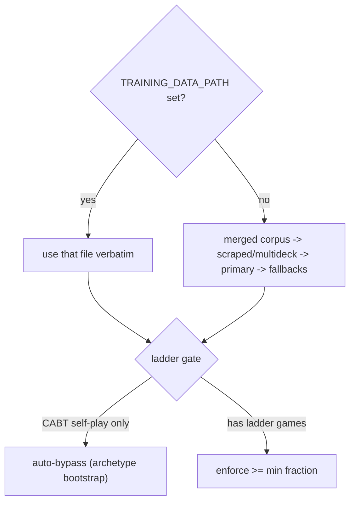

# Training data corpus policy

There are two distinct training-data regimes. Mixing them is what caused the
"trained on the wrong 13 GB corpus" and "ladder gate crashed the bootstrap" issues,
so the rules below are now enforced in code, not convention.

## 1. General (deck-agnostic) corpus

Used by `scripts/run_full_pipeline.sh` and `scripts/prepare_training_data.py`.

- Source of truth: `data/training_rollouts_merged.jsonl`, built from the official
  episodes-index competition replays plus multideck CABT games.
- Must contain top-of-ladder (episodes-index) games. The
  `assert_bootstrap_training_data` gate enforces this and fails fast if the merged
  corpus is synthetic-only.
- Resolution: with no `TRAINING_DATA_PATH` set, `resolve_training_data_path` prefers
  the merged corpus.

## 2. Archetype-specialized corpus

Used by `scripts/run_archetype.sh <archetype>`.

- Source of truth: a single per-archetype file, `data/<archetype>_bootstrap.jsonl`,
  generated by `scripts/generate_cabt_data.py` (or auto-generated on first run via
  `scripts/ensure_bootstrap_data.sh`).
- These are CABT self-play games (`source: multideck-cabt`) with no ladder games by
  design. The top-of-ladder gate auto-bypasses them — see
  `is_cabt_self_play_corpus` in `poke_agent/training_diversity.py`. You no longer need
  `REQUIRE_TOP_OF_LADDER_DATA=0`.
- Single-deck archetypes (Abomasnow, Iono) produce mirror-only bootstraps, so their
  profiles set `REQUIRE_TRAINING_MATCHUP_DIVERSITY=0`.

## The one knob: `TRAINING_DATA_PATH`

`TRAINING_DATA_PATH` is the single explicit training corpus and wins over the
merged/primary/fallback precedence chain. `run_archetype.sh` sets it to the
archetype bootstrap, so there is no "merged corpus silently wins" trap. When it is
unset, the general regime applies.

## Disk retention

`data/` and `outputs/` are gitignored and can reach hundreds of GB. Prune with
`scripts/prune_outputs.sh` (dry run by default; `--apply` to delete). It keeps named
tensor caches plus the newest hash caches, and the last N self-play checkpoints per
archetype.
