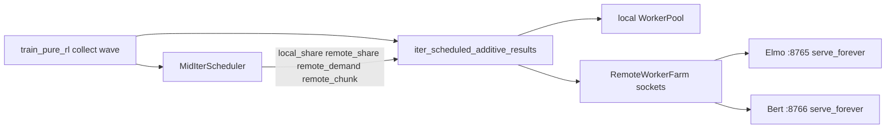

# Remote job scheduler extraction (public-play LAN dispatch)

Status: **design only — no production activation**  
Branch: `cursor/remote-job-scheduler-extract-045a`  
Related: [THROUGHPUT_NEXT_ITER.md](THROUGHPUT_NEXT_ITER.md), [engine_rebuild_multi_game.md](engine_rebuild_multi_game.md)

## Goal

Extract the system that **schedules whole-game collect jobs during public-play
waves onto other LAN computers** (Elmo / Bert additive farms) into a reusable
external package, then progressively rewrite the hot path in C++ for max
dispatch speed — **without touching live production** (selector, systemd
trainer, healthy training process, or Elmo production compose).

Production currently pins adaptive mid-iter rebalance off
(`PURE_RL_MID_ITER_SCHEDULER=0` in `config/specialist_runtime.env`) and hard-pins
128 workers. This plan must not reverse that.

## What this is (and is not)

| In scope | Out of scope |
|---|---|
| TCP length-prefixed job protocol | Specialist transition graph / cycle handoff |
| `RemoteJobClient` / farm / `serve_forever` | Deck-guide / strategic-head / ladder mix “schedules” |
| Additive local+remote collect (`iter_*_additive_results`) | `libcg` / engine multi-env rewrite (separate track) |
| Mid-wave capacity controller (`MidIterScheduler`) | Live-pool iter-boundary watcher (sibling; optional later) |
| Demand grow/shrink, chunk claim, endpoint-owned queues | Checkpoint rsync / SMB staging (host-specific adapters) |
| Generic opaque job bytes + completion credits | Pokemon matchup-runtime markers, leaf GPU striping |

This is **not** cron, Airflow, or specialist orchestration. It is a
**wave-scoped, additive whole-job dispatcher**: local workers + N remote TCP
sockets, rebalanced on wall-clock completions, never killing in-flight games.

## Current architecture (as shipped)



### Source map (~5.6k LOC core)

| Layer | Path | ~LOC | Role |
|---|---|---:|---|
| Decision engine | [`poke_bot/pure_rl/mid_iter_scheduler.py`](../poke_bot/pure_rl/mid_iter_scheduler.py) | 1.2k | Wave GPS tracker, demand probes, share/worker targets |
| Dispatch + protocol | [`poke_bot/remote_jobs.py`](../poke_bot/remote_jobs.py) | 3.9k | Framing, client, farm, additive iterators, `serve_forever` |
| RAM helper | [`poke_bot/live_pool.py`](../poke_bot/live_pool.py) `max_local_workers_for_ram` | small | Injected into mid-iter |
| Trainer wiring | [`scripts/train_pure_rl.py`](../scripts/train_pure_rl.py) `_collect` / `_additive_iter` | glue | Public-mix vs practice kinds, remote allow |
| Worker process | [`scripts/run_remote_worker.py`](../scripts/run_remote_worker.py) | ~2k | Pokemon sim handler behind `serve_forever` |

### Wire protocol (keep stable)

- TCP, one job in flight per socket (concurrency = open sockets).
- Frame: `!I` big-endian uint32 length + UTF-8 JSON body (optional `orjson`).
- `PROTO_VERSION = 1`.
- Control: `hello` / `hello_ok`, `ping`/`pong`, `health`, `reload`, `pin`/`unpin`, `rotate`, `bye`.
- Data: `{type: job, kind, job}` → `{type: result, ok, result}` (or `error`).
- Design invariant: **whole-game jobs**, chunked claim lists, **not** per-leaf RPCs over LAN.

### Hot paths / bottlenecks today

1. **Python GIL + many threads** in `iter_scheduled_additive_results` (claim lock, grow lock, per-socket request threads, refill monitor).
2. **JSON encode/decode** of large self-play result bodies (up to 256 MiB frame cap).
3. **Per-job deepcopy + host path remap** in `prepare_remote_play_job`.
4. **Scheduler tick** every ~15s is cheap; **claim/credit arithmetic under locks** is hotter under high GPS.
5. **LAN RTT** amortized by large `remote_chunk` / endpoint-owned queues — do not regress to chatty per-game scheduler RPCs.
6. Game sim time on remotes dominates wall clock; dispatcher C++ wins matter most when **socket count, refill, and result fan-in** become the limiter (many endpoints, small games, or multi-env remotes).

## Extraction boundary

### Package name (chosen)

`wave_dispatch` — generic mid-wave additive job dispatcher + capacity controller.

Suggested layout (new, **sidecar to poke-bot**, not activated in production):

```
packages/wave_dispatch/
  pyproject.toml
  README.md
  include/wave_dispatch/          # C++ public headers (phase 2+)
  src/wave_dispatch/              # C++ implementation
  python/wave_dispatch/           # thin Python package / pybind11
    __init__.py
    protocol.py                   # frame codec + message types
    client.py                     # RemoteJobClient equivalent
    server.py                     # serve_forever equivalent
    scheduler.py                  # MidIterScheduler equivalent
    collector.py                  # additive / scheduled iterators
    capacity.py                   # EndpointCapacity protocol
  tests/
  benchmarks/
```

### Generic core (move)

1. **Framing** — `encode_frame` / `read_frame` / `send_frame`, max frame, proto version.
2. **Session client** — connect/hello, ping, submit opaque job dict/bytes, control RPCs with hangup retry.
3. **Accept loop** — `serve_forever` with idle-timeout keep-alive, connection semaphore, handler callback.
4. **Farm** — multi-endpoint connect (soft-drop vs require-all), reload/pin fan-out with slow-but-alive policy.
5. **Collector** — spillable result queue, local+remote additive emitters, endpoint-owned demand queues, low-water refill, claim credits, tail-straggler override.
6. **Scheduler** — `WaveGpsTracker`, `DemandCompletionProbe`, share/demand/chunk decisions from completion feed + injectable hardware signals.
7. **Config** — typed knobs (tick, settle, frac floors, demand defaults/maxima) instead of hard-coded `PURE_RL_*` / Elmo/Bert IPs.

### Pokemon / host adapters (stay in poke-bot)

Keep as thin wrappers that call `wave_dispatch`:

- `prepare_remote_play_job`, Elmo/Bert checkpoint staging (SMB/GVFS/rsync).
- Matchup-runtime hello fields and capability gates.
- `run_remote_worker.py` job handler (play / promotion / leaf lifecycle).
- Trainer public-mix policy (`PURE_RL_PUBLIC_MIX_*`, local-only slice).
- Leaf GPU0 frac bias and 3080/Blackwell assumptions (optional policy plugin).
- Env-var bridge that maps existing `PURE_RL_*` / `POKEBOT_REMOTE_*` names onto the generic config **only when explicitly enabled**.

### Public interfaces (stable contracts)

```text
# Capacity plugin
EndpointCapacity:
  default_workers(endpoint) -> int
  max_workers(endpoint) -> int

# Hardware plugin
sample_signals() -> HardwareSignals   # or inject snapshots

# Scheduler
bind_endpoints(caps)
note_completed(side, n, decisions)
maybe_tick(remaining, force=False) -> Decision | None
decision() -> Decision  # local_share, remote_share, remote_demand, remote_chunk, target_workers, ...

# Collector (Python API initially)
iter_scheduled(local_pool, local_fn, jobs, remote_clients, scheduler, ...) -> Iterator[result]

# Job payload
opaque JSON object; dispatcher never interprets Pokemon fields
```

## Phased plan (production untouched)

### Phase 0 — Design freeze (this doc)

- Lock scope, interfaces, and “no production wiring” rule.
- Inventory tests that define behavior:
  - `tests/test_remote_demand_caps.py`
  - `tests/test_remote_checkpoint_staging.py` (collector behavior; staging stays poke-bot)
  - `tests/test_remote_endpoint_chunks.py`
  - relevant slices of `tests/test_dashboard_regressions.py` / `test_live_pool_plan.py`

### Phase 1 — Extract Python package in-repo (no trainer switch)

1. Create `packages/wave_dispatch/` with `pyproject.toml` (setuptools/scikit-build later).
2. Move/copy generic pieces from `remote_jobs.py` + `mid_iter_scheduler.py` into the package.
3. Replace Elmo/Bert hardcodes with `EndpointCapacity` maps supplied by callers.
4. Inject `max_local_workers_for_ram` / hardware sampling via callables.
5. Port unit tests into `packages/wave_dispatch/tests/` (no systemd, no selector).
6. Leave poke-bot imports pointing at **existing** modules. Add optional shim only behind an explicit env such as `POKEBOT_USE_WAVE_DISPATCH=0` (default off). **Do not flip defaults.**

Deliverable: installable pure-Python package + parity tests; production binary path unchanged.

### Phase 2 — Protocol hardening for reuse

1. Formalize message schema (JSON Schema or protobuf IDL kept dual-readable).
2. Split **control plane** vs **data plane** timeouts (already partially done).
3. Add capability negotiation that is domain-agnostic (`job_kinds`, `capabilities` strings).
4. Optional content-type: JSON jobs today; allow `content_type=msgpack|raw` later without breaking v1.
5. Benchmark harness: synthetic echo workers measuring claim→submit→result GPS vs Python baseline.

### Phase 3 — C++ core for max dispatch speed

Rewrite **only the dispatcher/runtime**, not the Pokemon sim:

| Component | Language | Why |
|---|---|---|
| Frame codec + socket I/O | C++ (asio or raw epoll/kqueue) | Avoid GIL; many sockets |
| Connection accept + per-socket state machine | C++ | `serve_forever` hot loop |
| Claim/credit/demand queues | C++ | Lock-friendly atomics / sharded queues |
| Wave GPS + demand probe math | C++ | Tiny; keep policy identical |
| Mid-iter decision policy | C++ or keep Python | Policy changes often; start C++, keep Python mirror for A/B |
| Job handler / sim | stays Python (or engine C++) | Domain work |
| Checkpoint staging | stays Python/shell | Host FS specifics |
| pybind11 / cffi façade | Python | Drop-in `wave_dispatch.collector` |

**Do not** put battle simulation inside this package — that is the separate
engine rebuild track. This package ships **opaque jobs** and **opaque results**.

Suggested C++ module split:

```text
wave_dispatch::net::FrameCodec
wave_dispatch::net::ClientSession
wave_dispatch::net::Server
wave_dispatch::sched::WaveGpsTracker
wave_dispatch::sched::DemandProbe
wave_dispatch::sched::MidWaveController
wave_dispatch::collect::ClaimLedger
wave_dispatch::collect::EndpointQueue
wave_dispatch::collect::AdditiveCollector
```

Build: CMake + pybind11 wheel; CI builds manylinux + macOS (Bert) artifacts.
Keep a pure-Python fallback so remotes without the wheel still run.

### Phase 4 — Opt-in poke-bot integration (still non-production)

1. Adapter module `poke_bot/wave_dispatch_adapter.py` mapping env + staging.
2. Canary path on a **non-production** collect (smoke / staging trainer only):
   `POKEBOT_USE_WAVE_DISPATCH=1` + mid-iter allowed only in staging profiles.
3. Parity receipts: same job list → same completion counts; GPS within noise;
   demand grow/shrink probe behavior matches golden traces from Phase 1 tests.
4. **No** change to `config/specialist_runtime.env`, live systemd units, Elmo
   `docker-compose.production.yml`, or Bert production launchd until an owner
   orders a receipt-backed boundary activation.

### Phase 5 — Production consideration (explicit future order only)

Only after Phase 4 receipts and an owner boundary order:

- Deploy wheels beside a new immutable runtime root.
- Flip mid-iter / wave_dispatch behind selector at a safe iter/promotion boundary.
- Respect GOAL pin: adaptive rebalance must not lower the 128-worker floor while that pin is active.

This phase is **out of scope for the extraction workstream** until ordered.

## Optimization priorities (once extracted)

Ordered by expected dispatcher-side win:

1. **C++ collector + socket reactor** — eliminate GIL contention across dozens of remote sockets.
2. **Sharded per-endpoint queues** (already conceptually present) with lock-free or fine-grained C++ queues.
3. **Faster codec** for large results (reuse `orjson` from Python; in C++ prefer SIMD JSON or length-prefixed blob passthrough when poke-bot can accept opaque bytes).
4. **Batch control** — multi-job submit per frame (proto v2) while keeping whole-game semantics; larger chunks beat smaller frames.
5. **io_uring / kqueue** on Linux/macOS workers for accept/read fan-in.
6. Keep policy probes on **wave wall-clock GPS only** — never reintroduce batch-dump instantaneous rates.

Non-goals for speed:

- Moving leaf eval over LAN (regress).
- Killing in-flight games to rebalance (forbidden).
- Chatty per-game scheduler RPCs (forbidden).

## Production safety checklist (hard rules)

- Do **not** restart, stop, or replace `pokebot-pure-rl-*`, gate handler, or handoff services for this work.
- Do **not** mutate `/home/inzi/.config/pokebot/specialist_runtime.env` or deployment roots.
- Do **not** change Elmo `docker-compose.production.yml` or Bert production launchd as part of extraction.
- Do **not** enable `PURE_RL_MID_ITER_SCHEDULER` in the canonical selector.
- Do **not** preempt healthy active training to validate the package.
- Interactive SSH/Codex/Cursor sessions remain untouched.
- All work stays on feature branch + optional local/staging processes.

## Success criteria

1. `wave_dispatch` installs and runs its own pytest suite with **zero** imports of `poke_bot.*`.
2. Synthetic echo benchmark documents Python vs C++ collector GPS / CPU%.
3. poke-bot still uses in-tree `remote_jobs` / `mid_iter_scheduler` by default.
4. Optional adapter exists but default-off; production selector unchanged.
5. Design invariants preserved: whole-game jobs, chunked remotes, completion-gated demand, no in-flight kills.

## Immediate next implementation steps (when exiting design-only)

1. Scaffold `packages/wave_dispatch/` + `pyproject.toml`.
2. Lift framing + `serve_forever` + client (no staging) with ported tests.
3. Lift `WaveGpsTracker` / `DemandCompletionProbe` / scheduler with injectable caps.
4. Lift additive collector behind the duck-typed scheduler protocol.
5. Add echo-worker microbench; defer C++ until Python package parity is green.
