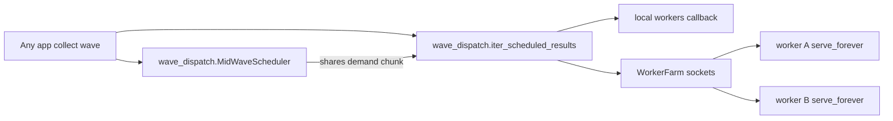

# Plan: `wave_dispatch` — standalone LAN job-dispatch library

Status: **/plan only — no implementation, no production changes**  
Branch: `cursor/remote-job-scheduler-extract-045a`  
Product: a **separate library** you can install and use in any project  
Reference source (read-only for this plan): poke-bot-agent public-play LAN dispatch

Related context in this repo: [THROUGHPUT_NEXT_ITER.md](THROUGHPUT_NEXT_ITER.md), [engine_rebuild_multi_game.md](engine_rebuild_multi_game.md)

---

## Verdict

Ship **`wave_dispatch` as its own git repository and installable package** (Python first, C++ core later). Generalize the poke-bot public-play → Elmo/Bert whole-job dispatcher into domain-agnostic APIs. **poke-bot keeps its current in-tree code and production stays untouched**; adopting the library later is an optional consumer decision, not part of standing up the library.

---

## What you get as a library user

```bash
pip install wave-dispatch          # or: pip install git+https://github.com/<you>/wave-dispatch
```

```python
from wave_dispatch import (
    JobClient,
    WorkerFarm,
    serve_forever,
    MidWaveScheduler,
    iter_scheduled_results,
)

# Worker box
serve_forever(handler=my_job_fn, host="0.0.0.0", port=8765, hello=my_hello)

# Controller
farm = WorkerFarm(endpoints=["host-a:8765", "host-b:8766"])
farm.connect()
sched = MidWaveScheduler(config, capacity=my_caps)
for result in iter_scheduled_results(
    local_submit=my_local,
    jobs=job_dicts,           # opaque JSON objects
    remote_clients=farm.clients,
    scheduler=sched,
):
    ...
```

Jobs and results are **opaque**. The library never knows about Pokemon, checkpoints, or leaf GPUs.

---

## Source of truth in poke-bot (reference only)

The behavior to extract lives here today:

| Layer | Path | ~LOC | Role |
|---|---|---:|---|
| Decision engine | `poke_bot/pure_rl/mid_iter_scheduler.py` | 1.2k | Wave GPS, demand probes, share/worker targets |
| Dispatch + protocol | `poke_bot/remote_jobs.py` | 3.9k | Framing, client, farm, collectors, `serve_forever` |
| Worker entry | `scripts/run_remote_worker.py` | ~2k | Domain handler behind the generic server |

Wire protocol to preserve as v1:

- TCP, one in-flight job per socket (concurrency = open sockets)
- `!I` length + UTF-8 JSON body
- `hello` / `job` / `result` / `ping` / control (`reload`, `pin`, …)
- Whole jobs over LAN; chunked claims; never per-leaf RPCs



---

## Library home (chosen)

**Separate git repo** (not a `packages/` sidecar inside poke-bot).

Suggested:

| Item | Choice |
|---|---|
| Repo | `github.com/<owner>/wave-dispatch` (new) |
| PyPI name | `wave-dispatch` |
| Import | `wave_dispatch` |
| License | match owner preference (document in new repo) |
| poke-bot | stays independent; may depend later via pip/git URL |

This plan lives in poke-bot only as the **extraction brief**. Implementation commits belong in the new library repo.

### Target layout (new repo)

```text
wave-dispatch/
  README.md
  pyproject.toml
  LICENSE
  docs/
    PROTOCOL.md
    SCHEDULER.md
    MIGRATION_FROM_POKEBOT.md
  src/wave_dispatch/
    __init__.py
    protocol.py          # frame codec, message types
    client.py            # JobClient
    farm.py              # WorkerFarm
    server.py            # serve_forever
    scheduler.py         # MidWaveScheduler, WaveGpsTracker, DemandProbe
    collector.py         # additive + scheduled iterators
    capacity.py          # EndpointCapacity protocol / maps
    config.py            # typed knobs (no PURE_RL_* names)
    hardware.py          # optional signal sampling hooks
  tests/
  benchmarks/
    echo_worker.py
  # Phase C++ later:
  cpp/
    include/wave_dispatch/
    src/
    CMakeLists.txt
  python/bindings/       # pybind11 when C++ lands
```

Hard rule: **zero imports of `poke_bot`**. CI must fail if that appears.

---

## What moves into the library vs stays in consumers

### Into `wave_dispatch`

1. Frame codec (`encode_frame` / `read_frame` / `send_frame`)
2. `JobClient` session (hello, ping, submit opaque job, hangup retry)
3. `serve_forever` accept loop (idle keep-alive, connection cap, handler callback)
4. `WorkerFarm` (soft-drop vs require-all, control fan-out)
5. Additive / scheduled collectors (claim credits, endpoint-owned queues, low-water refill, spillable result queue, tail override)
6. `MidWaveScheduler` + wave wall-clock GPS + demand completion probes
7. Typed config + `EndpointCapacity` plugin (defaults/max per endpoint from caller)

### Stays in poke-bot (or any consumer)

- Checkpoint staging (SMB / GVFS / rsync), host path remaps
- Matchup-runtime hello fields / capability gates
- Sim / leaf / GPU job handlers
- Public-mix training policy and env bridges (`PURE_RL_*`, `POKEBOT_REMOTE_*`)
- Systemd / Docker / launchd deployment

Generic control ops (`reload`, `pin`, `rotate`) stay in the library as **opaque control frames**; consumers decide what they mean.

---

## Public API contract (stable)

```text
EndpointCapacity:
  default_workers(endpoint) -> int
  max_workers(endpoint) -> int

HardwareSignals / sample_signals()     # injectable; library ships a best-effort Linux sampler

MidWaveScheduler:
  from_config(cfg, *, baseline_workers)
  bind_endpoints(capacity | clients)
  note_completed(side, n, decisions=0)
  maybe_tick(remaining, force=False) -> Decision | None
  decision() -> Decision
    # local_share, remote_share, remote_demand, remote_chunk,
    # target_workers, reason, metrics, hardware

iter_scheduled_results(...):
  local_submit, jobs, remote_clients, scheduler, ...
  -> Iterator[result_dict]

Job payload: opaque JSON object
```

Env vars in the library use a neutral prefix (`WAVE_DISPATCH_*`), not `PURE_RL_*`.

---

## Phases (library repo)

### Phase 0 — Plan freeze (this document)

Done when this brief is accepted. No code in poke-bot production paths.

### Phase 1 — New repo + pure-Python v0.1

1. Create `wave-dispatch` repo with `pyproject.toml`, README, PROTOCOL.md.
2. Port framing, server, client, farm from `remote_jobs.py` (strip Elmo/Bert/staging).
3. Port scheduler from `mid_iter_scheduler.py` with injectable capacity + hardware hooks.
4. Port collector logic; local side is a callback, not WorkerPool.
5. Port/adapt unit tests from poke-bot (`test_remote_demand_caps`, collector behaviors) into library tests with synthetic echo workers.
6. Tag `v0.1.0`. Installable via `pip install -e .` / git URL.

**poke-bot unchanged.**

### Phase 2 — Reuse polish

1. Documented JSON schema for v1 frames.
2. Echo benchmarks (claim → submit → result GPS, CPU%).
3. Examples: “local+2 remotes map-reduce style jobs”, “fail-soft farm”.
4. Optional msgpack/raw content-type negotiation without breaking JSON v1.

### Phase 3 — C++ hot path (same library, optional extra)

Ship as optional package extra (`wave-dispatch[native]`) or same wheel with pybind11:

| Component | C++ | Why |
|---|---|---|
| Frame I/O + reactor | yes | many sockets, no GIL |
| Accept / session SM | yes | server hot loop |
| Claim / demand queues | yes | lock contention under high GPS |
| Wave GPS + demand math | yes | keep policy identical |
| Policy knobs / config | Python OK | changes often |
| Domain job handler | never | consumer-owned |

```text
wave_dispatch::net::FrameCodec
wave_dispatch::net::ClientSession
wave_dispatch::net::Server
wave_dispatch::sched::WaveGpsTracker
wave_dispatch::sched::DemandProbe
wave_dispatch::sched::MidWaveController
wave_dispatch::collect::ClaimLedger
wave_dispatch::collect::EndpointQueue
wave_dispatch::collect::AdditiveCollector
```

Keep pure-Python fallback so install works without a compiler.

### Phase 4 — Optional poke-bot consumer (separate, later, non-production)

Only if/when you want poke-bot to *use* the library:

1. Add `wave-dispatch` dependency in a **non-production** / staging path.
2. Thin adapter for staging + `PURE_RL_*` → `WAVE_DISPATCH_*` mapping.
3. Default remains in-tree `remote_jobs` / `mid_iter_scheduler`.
4. Never flip selector / systemd / Elmo production compose without an explicit owner boundary order.

**Standing up the library does not require Phase 4.**

---

## Performance priorities (library)

1. C++ collector + socket reactor  
2. Fine-grained / sharded per-endpoint queues  
3. Fast codec or opaque blob passthrough for large results  
4. Proto v2 multi-job frames (still whole-job semantics, large chunks)  
5. io_uring / kqueue where available  

Invariants: wave wall-clock GPS only; no in-flight kills; no chatty per-game scheduler RPCs; no leaf traffic over LAN.

---

## Production safety (poke-bot)

While this plan exists in the poke-bot tree as documentation only:

- Do not restart/replace trainer, gate, or handoff services
- Do not mutate live selector or deployment roots
- Do not enable `PURE_RL_MID_ITER_SCHEDULER` in canonical production env
- Do not change Elmo production compose / Bert production launchd for this work
- Do not preempt healthy training

The library repo has **no production coupling**.

---

## Success criteria (for the library)

1. Own repo; `pip install` works; import `wave_dispatch`.
2. Test suite green with **zero** `poke_bot` imports.
3. Echo-worker demo runs local + fake remotes.
4. README shows a non-Pokemon example.
5. poke-bot production path unmodified by library work.
6. Later: optional native extra beats pure-Python dispatcher CPU% at high socket counts.

---

## When leaving /plan (implementation order in `wave-dispatch` repo)

1. Scaffold repo + pyproject + PROTOCOL.md  
2. Port protocol + server + client + tests  
3. Port scheduler + capacity plugins + tests  
4. Port collector + echo benchmark  
5. Tag v0.1.0  
6. Only then consider C++ and/or poke-bot opt-in consumer work  
