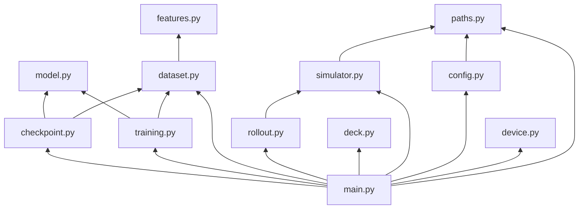

# `poke_agent` Module Reference

Detailed API and call-graph documentation for the refactored training package.
For system-level architecture, see [ARCHITECTURE.md](./ARCHITECTURE.md).

## Package dependency graph



No circular imports. Leaf modules: `device.py`, `features.py`, `model.py`, `deck.py`.

---

## `paths.py`

### `resolve_root(start: Path | None = None) -> Path`

Walks up from `start` (default `Path.cwd()`) until `requirements.txt` is found.
If the current directory is inside `notebooks/`, the parent repo root is selected.
Calls `os.chdir(root)` so relative paths in config work consistently.

### `print_runtime_info(root: Path) -> None`

Prints repo path and Python version. Called at pipeline start for log provenance.

---

## `config.py`

Edit the module-level variables at the top of `poke_agent/config.py` to change
data paths, model architecture, loss weights, and training loop settings.

### `build_config(root: Path, overrides: dict | None = None) -> dict[str, Any]`

Builds the nested runtime config from module constants. Optional `overrides` and
environment variables can supersede individual settings.

Returns a nested dict with keys:

```
agent_deck_path       Path
data_candidates       list[Path]     # tried in order
generated_path        Path
competition_results_path Path
output_path           Path
transition_classes    int
state_hash_dim        int
window_size           int
model                 dict           # d_model, heads, layers, ff, dropout, lr, wd
loss                  dict           # value, policy, dynamics, entropy, uncertainty
training              dict           # epochs, patience, min_delta, print_every, batch_size
```

### `resolve_cabt_episodes(config, simulator_available) -> int`

Uses `CABT_EPISODES` from config (`None` = auto: 3 when cg-lib is available).

---

## `device.py`

### `torch_device() -> torch.device`

Priority: `cuda` → `mps` → `cpu`. No env override — device selection is automatic.

---

## `simulator.py`

### `SimulatorState`

Frozen runtime view of cg-lib availability:

| Field | Type | Notes |
|---|---|---|
| `lib_path` | `str \| None` | Resolved cg-lib directory |
| `available` | `bool` | `True` only if all callables loaded |
| `error` | `str \| None` | `repr(exc)` from failed import |
| `battle_start` | callable | `(deck0, deck1) -> (obs, start_data)` |
| `battle_select` | callable | `(obs) -> next_obs` |
| `battle_finish` | callable | `() -> None` |
| `to_observation_class` | callable | Parse raw obs dict |

### `find_cg_lib(root: Path) -> str | None`

Search order:

1. `$CG_LIB_PATH`
2. `/kaggle/input/**/cg-lib` (glob)
3. `{root}/kaggle/input/**/cg-lib` (glob)

### `load_simulator(root: Path) -> SimulatorState`

Appends found path to `sys.path`, imports `cg.game` and `cg.api`. Never raises —
returns `available=False` with error string on failure.

### `print_simulator_status(state) -> None`

Logs path, availability, and error for operator visibility.

---

## `deck.py`

### `read_deck(config, root) -> tuple[list[int], Path]`

Returns `(deck_ids, source_path)`. Raises `ValueError` if a found file does not
contain exactly 60 integers.

### `SAMPLE_DECK`

Hard-coded fallback used when no deck file exists on disk.

---

## `rollout.py`

### `features_from_observation(obs: dict) -> list[float]`

Extracts the 10-dim compact vector. Pure function, no cg-lib dependency.

### `make_random_agent(to_observation_class) -> Callable`

Factory returning an agent that uniformly samples legal option indices.

### `play_episode(episode, deck, simulator, agent, max_steps=300) -> list[dict]`

Runs one self-play game (same deck both sides). Raises if simulator unavailable.

Lifecycle:

```
battle_start(DECK, DECK)
  loop while result < 0 and step < max_steps:
    append row with features
    battle_select(agent(obs))
  assign value labels from final result
battle_finish()  # always in finally
```

### `generate_rollouts(simulator, deck, episodes, output_path) -> int`

Writes JSONL if `simulator.available` and `episodes > 0`. Returns row count (0 if
skipped). Prints skip message otherwise.

---

## `features.py`

### `stable_hash_index(text, size) -> int`

BLAKE2b-64 → integer mod `size`. Deterministic across runs and platforms.

### `iter_state_items(value, prefix="")`

Depth-first walk of dicts/lists yielding `(dotted_path, leaf_value)` pairs.
Dict keys are sorted for stable ordering.

### `hashed_state_vector(observation, action, *, state_hash_dim) -> np.ndarray`

Builds sparse hash vector of dimension `state_hash_dim`.

### `combine_features(coarse, observation, action, *, state_hash_dim) -> np.ndarray`

Concatenates compact + hash vectors. Without observation, returns compact only.

### `row_feature_vector(row, *, state_hash_dim) -> np.ndarray`

Row-level wrapper using `row["features"]`, `row.get("observation")`, `row.get("action")`.

### `row_next_feature_vector(row, *, state_hash_dim) -> np.ndarray`

Uses explicit `next_observation`/`next_features` when present, else falls back.

### `build_training_arrays(rows, *, transition_classes, state_hash_dim, window_size)`

Core dataset builder. Groups rows by episode, sorts by step, and emits seven
numpy arrays:

| Array | Shape | Dtype |
|---|---|---|
| `xs` | `(N, F)` | float32 |
| `values` | `(N,)` | float32 |
| `transition_targets` | `(N,)` | int64 |
| `next_features` | `(N, F)` | float32 |
| `terminal_mask` | `(N,)` | float32 |
| `history_indices` | `(N, WINDOW_SIZE)` | int64 |
| `history_mask` | `(N, WINDOW_SIZE)` | float32 |

Padding index for history = `N` (mapped to a zero row in the padded tensor).

---

## `cabt_validation.py`

Validates that training data comes from real CABT evaluation games produced by
`scripts/generate_cabt_data.py` (the `cg.game` engine), not compact inline
rollouts or synthetic arrays.

### `is_cabt_evaluation_row(row) -> bool`

Checks required fields and CABT observation structure (`current.result`,
`current.yourIndex`, two `players`).

### `assert_cabt_evaluation_rows(rows, *, path, min_rows=1) -> None`

Raises `CabtEvaluationDataError` on the first invalid row. Prints confirmation
when all rows pass.

### `resolve_cabt_eval_data_path(candidates) -> Path | None`

Returns the first candidate file whose sample rows pass CABT evaluation checks.
Raises if a file exists but contains non-evaluation rows.

---

## `dataset.py`

### `load_jsonl(path) -> list[dict]`

Standard JSONL reader. Skips blank lines.

### `TrainingTensors` dataclass

Container for all torch tensors plus normalization stats. Created once before training.

### `prepare_training_tensors(config, device) -> TrainingTensors`

1. Resolve `data_path` from `data_candidates`
2. Load JSONL or synthesize 128 smoke rows
3. Call `build_training_arrays`
4. Normalize features
5. Move to `device`

Prints tensor shapes for debugging.

---

## `model.py`

### `TransformerRLModel`

Standard PyTorch `nn.Module`.

#### `encode(x, mask) -> Tensor`

Projects tokens, adds position embeddings, runs `TransformerEncoder` with padding
mask (`mask <= 0`), returns normalized representation of **last timestep**.

#### `forward(x, mask) -> dict[str, Tensor]`

Returns dict with keys: `value`, `policy_logits`, `next_features`, `log_variance`.

Input shapes:
- `x`: `(batch, window_size, input_dim)`
- `mask`: `(batch, window_size)` — 1.0 for real, 0.0 for pad

---

## `training.py`

### `build_model(config, tensors, device) -> TransformerRLModel`

Validates head divisibility, constructs model, prints parameter count.

### `train_model(model, tensors, config, device) -> dict[str, Any]`

Full training loop with:

- Shuffled batch indices each epoch
- tqdm progress for epochs and batches
- Early stopping on `total_loss`
- Best-state checkpoint restore

Returns `training_report` dict (metrics, epochs, paths, loss note).

---

## `checkpoint.py`

### `load_competition_results(path) -> list[dict]`

Reads Kaggle score history JSONL. Returns `[]` if missing.

### `save_checkpoint(...) -> dict[str, Any]`

Augments `training_report` with competition result metadata, serializes checkpoint
to `output_path`.

Checkpoint schema:

```python
{
    "model_state_dict": OrderedDict,
    "model_type": "temporal_transformer_rl_complex_loss",
    "input_dim": int,
    "policy_dim": int,
    "model_config": { d_model, heads, layers, dim_feedforward, dropout, window_size },
    "feature_mean": list[float],
    "feature_std": list[float],
    "loss_weights": { value, policy, dynamics, entropy, uncertainty },
    "training_report": dict,
    "device_used": str,
    "data_path": str | None,
}
```

### `print_training_report(report, output_path) -> None`

Human-readable summary to stdout.

---

## `main.py`

### `main() -> None`

Ordered pipeline — no branching except automatic skips:

| Step | Skip condition |
|---|---|
| Rollout generation | `CABT_EPISODES == 0` or cg unavailable |
| Real data load | No candidate files → synthetic smoke data |

Entry points:

```bash
python -m poke_agent.main
python scripts/train_agent.py
```

---

## Testing and validation strategy

| Check | Command |
|---|---|
| Syntax / import | `python -m compileall poke_agent` |
| Smoke run (fast) | `TRAIN_EPOCHS=1 BATCH_SIZE=32 python scripts/train_agent.py` |
| Verify checkpoint | `python -c "import torch; print(torch.load('out/value_model.pt').keys())"` |
| Package import | `python -c "from poke_agent.main import main"` |

---

## Migration guide: notebook cell → module

| Notebook cell | Module |
|---|---|
| Cell 1 — imports + ROOT | `paths.py`, `main.py` |
| Cell 2 — CONFIG | `config.py` |
| Cell 3 — DEVICE | `device.py` |
| Cell 4 — cg-lib | `simulator.py` |
| Cell 5 — deck | `deck.py` |
| Cell 6 — play_episode | `rollout.py` |
| Cell 7 — generate | `rollout.generate_rollouts` |
| Cell 8 — arrays | `features.py`, `dataset.py` |
| Cell 9 — model + train | `model.py`, `training.py` |
| Cell 10 — save | `checkpoint.py` |
