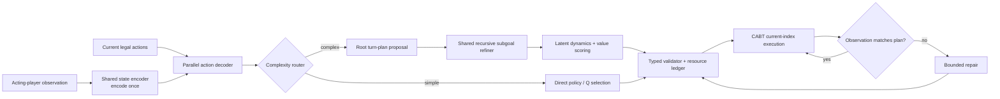

# Executive Design — PokeRLM

## Decision

Redesign the decision layer around a **bounded recursive latent turn planner** while retaining the strongest reusable state encoder, legal-action representation, policy/value knowledge, simulator adapter, and training infrastructure.

The existing problem is not that MCTS is conceptually wrong. It is that the deployment environment permits only about **75 simulator calls across the entire turn**, and using that full allowance consumes the available turn time. Pokémon turns can contain many order-sensitive micro-decisions, so broad online tree search cannot reach useful depth or breadth.

## The replacement

**PokeRLM** performs most planning as amortized neural inference:

The system creates a conditional plan once, then follows it through real observations. It does not restart a tree search after every card selection, target choice, or confirmation.

## Why RLM ideas fit nonlinear decks

PokeRLM is most valuable when action values are strongly non-additive:

- card order changes reachable outcomes;
- one action changes the value or legality of later actions;
- search and draw outcomes require explicit fallback branches;
- a temporarily weak move unlocks a delayed payoff;
- multiple resource routes reach the same tactical objective;
- a turn has several competing macro-objectives;
- a plan must preserve a recovery line after stochastic failure.

A flat next-action policy tends to average across these lines. A typed recursive planner can instantiate, refine, compare, and execute complete conditional plans.

## What is retained

- CABT remains the real rules engine, legal-action source, and transition authority.
- The shared deck-agnostic encoder remains the repository of transferable mechanics and card knowledge where compatible.
- The existing action-conditioned policy, distributional Q, multi-horizon value, successor, and uncertainty ideas become the planner's fast evaluator.
- The established shared-core → sequential specialists → population self-play protocol remains authoritative.

## What changes

- The deployment unit becomes a **turn plan**, not an isolated action.
- A complexity router decides whether recursion is warranted.
- A typed plan intermediate representation carries sequences, conditions, subgoals, and fallbacks.
- A learned short-horizon latent model scores candidate plan fragments without repeated simulator calls.
- Online simulator work becomes sparse verification, not discovery.
- Actual observations update or invalidate the plan; model-predicted state never overrides CABT.

## Target operating envelope

| Item | Initial target |
|---|---:|
| Recommended shared model | `base_384`, about 35.7M parameters |
| New planner attachment | about 14.5M parameters with a compatible existing encoder |
| Specialist adapter | about 0.4M–0.9M per archetype |
| Root plans proposed | 4–8, batched |
| Recursion depth | 2 |
| Plan node cap | 32 |
| Neural planner calls per turn | at most 4 |
| Normal online simulator calls | 0–16 |
| Legacy measured simulator ceiling | about 75 for the entire turn |
| Fallback | existing deterministic policy |

## Explicit non-goals

- No natural-language chain of thought in the game agent.
- No arbitrary Python or REPL emitted by the model.
- No exact full-game world-model rollout inside the network.
- No unbounded recursion.
- No per-action backbone inference.
- No requirement to use all 75 simulator calls.
- No immediate removal of the current policy or MCTS baseline; both remain necessary for comparison and fallback during migration.

## Success criterion

PokeRLM succeeds only if it improves playing strength—especially on order-sensitive nonlinear decks—at a safe p95 whole-turn latency, with zero legality regression, no hidden-information leakage, and no material regression on simple decks or held-out archetypes.
